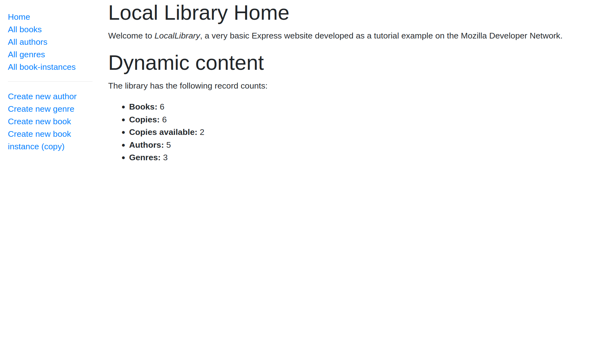

# Local Library

The Local Library Project is a web-based library management system built using Node.js, Express.js, and Mongoose. It allows users to browse a catalog of books, check out authors and reserved books, and manage library assets.



## Try it yourself
You can find the live version [here](https://local-library-production-c2ea.up.railway.app).

## Features

- Interface for browsing and managing books, authors, instances and genres.
- Mongoose as MongoDB database ODM
- Mongoose models with virtuals for easy db interaction.
- Proper MVC based structure.
- Pug as view engine.

## Running it locally

### Prerequisites

Before running the application, you'll need the following:

- Node.js and npm installed on your system.
- MongoDB installed locally or a connection to a MongoDB instance.

### Installation

1. Clone the repository:

```bash
git clone https://github.com/Sankalp-G/Local-Library
```

2. Install dependencies:

```bash
cd Local-Library
npm install
```

3. Set up environment variables:
   - Create a `.env` file in the root directory.
   - Add the necessary mongodb environment variables:
```bash
DB_USER=
DB_PASSWORD=
DB_CLUSTER_URL=
```

4. Start the application:

```bash
npm start
```

5. Visit `http://localhost:3000` in your web browser.
